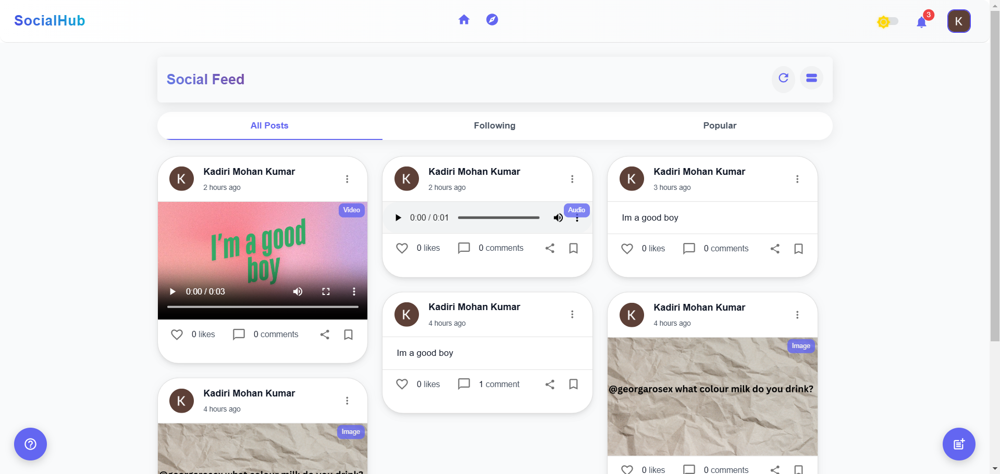
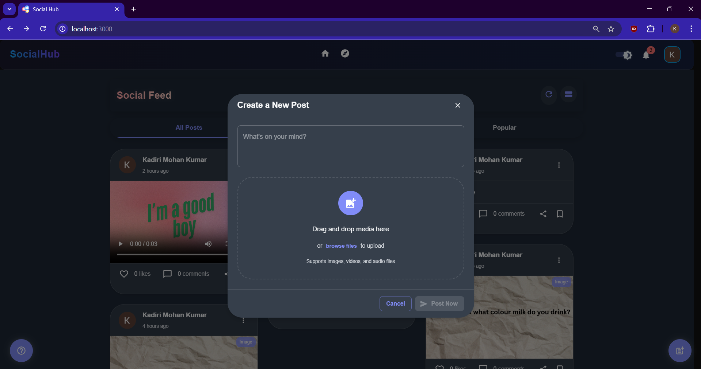
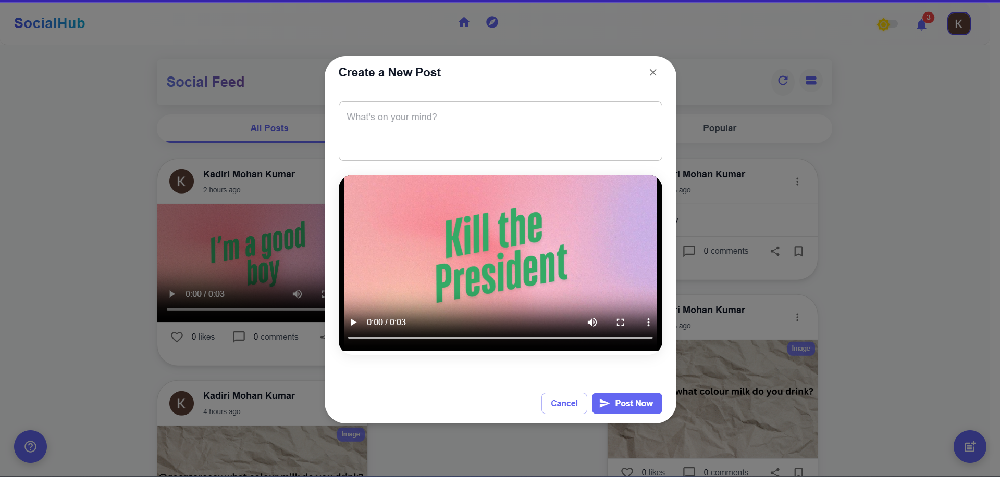
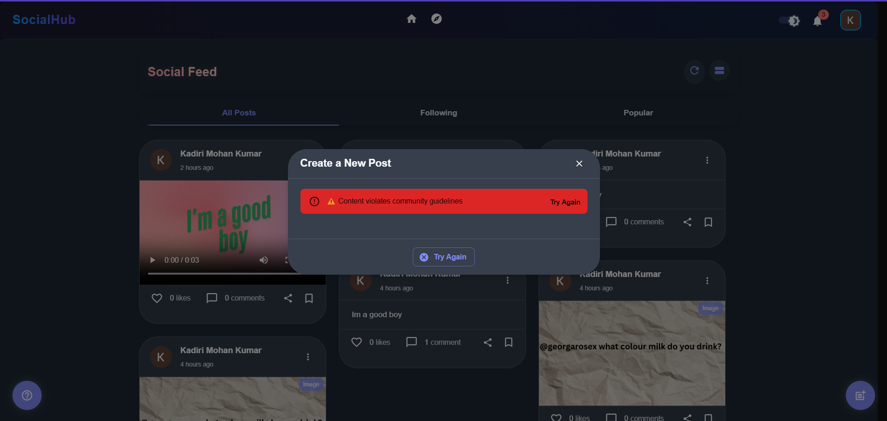
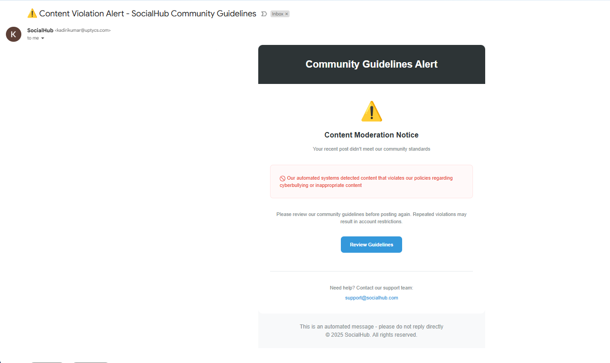

# Social Media Application

This is a full-stack social media application built with a **React.js frontend** and a **Node.js (Express) backend**. It features modern UI/UX, AI-powered content moderation, and seamless backend integration. Users can create posts, interact with content, and stay connected in a safe and engaging environment.








---

## **Setup Instructions**

### **Backend Setup**

1. Navigate to the backend directory:
   ```bash
   cd backend
   ```

2. Install dependencies:
   ```bash
   npm install
   ```

3. Create a `.env` file in the backend directory and add the necessary environment variables. Use the `.env.sample` file as a reference. The required variables include:
   - `MONGO_URI`: MongoDB connection string
   - `GOOGLE_CLIENT_ID`: Google OAuth client ID
   - `GOOGLE_CLIENT_SECRET`: Google OAuth client secret
   - `CLOUDINARY_CLOUD_NAME`: Cloudinary cloud name
   - `CLOUDINARY_API_KEY`: Cloudinary API key
   - `CLOUDINARY_API_SECRET`: Cloudinary API secret
   - `EMAIL_USER`: Email address for sending notifications
   - `EMAIL_PASS`: Password for the email account
   - `SESSION_SECRET`: Secret key for session encryption
   - `AI_API_URL`: URL for the AI moderation API (e.g., `http://localhost:17291/api/predict`)

4. Start the backend server:
   ```bash
   npm start
   ```

---

### **Frontend Setup**

1. Navigate to the frontend directory:
   ```bash
   cd frontend
   ```

2. Install dependencies:
   ```bash
   npm install
   ```

3. Create a `.env` file in the frontend directory and add the necessary environment variables. Use the `.env.sample` file as a reference. The required variables include:
   - `REACT_APP_API_URL`: URL of the backend API (e.g., `http://localhost:5000`)
   - `REACT_APP_GOOGLE_CLIENT_ID`: Google OAuth client ID

4. Start the frontend development server:
   ```bash
   npm run dev
   ```

---

### **Accessing the Application**

- The frontend will be available at `http://localhost:3000`.
- The backend will be available at `http://localhost:5000`.

---

## **Features**

### **Core Features**
- **User Authentication:**
  - Secure Google OAuth 2.0 login.
  - Session-based authentication with cookies.

- **Content Creation:**
  - Create posts with text, images, videos, or audio.
  - Drag-and-drop media uploads.
  - AI-powered content moderation to detect and block cyberbullying.

- **Interactions:**
  - Like and comment on posts.
  - View posts in an Instagram-style grid layout.
  - Click on posts to view them in a modal with smooth animations.

- **Notifications:**
  - Email notifications for content violations.
  - Real-time updates for likes and comments.

- **UI/UX:**
  - Modern, responsive design with Material-UI.
  - Dark mode and light mode toggle.
  - Smooth animations powered by Framer Motion.

---

### **AI-Powered Moderation**
- Posts are analyzed by a Flask-based AI API for cyberbullying detection.
- If content is flagged, the post is blocked, and the user is notified via email.

---

## **Technologies Used**

### **Frontend**
- **React.js**: JavaScript library for building user interfaces.
- **Material-UI (MUI)**: Component library for modern UI design.
- **Framer Motion**: Animation library for smooth transitions.
- **Redux Toolkit**: State management for global state.
- **Axios**: HTTP client for API requests.
- **React Dropzone**: Drag-and-drop file uploads.

### **Backend**
- **Node.js**: JavaScript runtime for server-side development.
- **Express.js**: Web framework for building RESTful APIs.
- **MongoDB**: NoSQL database for storing user data and posts.
- **Mongoose**: MongoDB object modeling for Node.js.
- **Cloudinary**: Media storage and management.
- **Passport.js**: Authentication middleware for Google OAuth.
- **Nodemailer**: Email notifications for users.
- **Flask API**: AI-powered content moderation.

---

## **Project Structure**

### **Frontend**
```
/client
│── /src
│   │── /components       # Reusable UI components
│   │── /pages            # Page components (Home, Login, Profile, etc.)
│   │── /features         # Redux slices and API logic
│   │── /utils            # Helper functions
│   │── App.js            # Main application component
│   │── index.js          # Entry point
│── package.json
```

### **Backend**
```
/server
│── /config               # Configuration files (MongoDB, Cloudinary, etc.)
│── /controllers          # Business logic for handling requests
│── /models               # Mongoose schemas
│── /routes               # API endpoints
│── /middlewares          # Authentication and validation middlewares
│── /utils                # Helper functions
│── server.js             # Main entry point
│── package.json
```

---

## **Deployment**

### **Database**
- Use **MongoDB Atlas** for cloud-based database hosting.

### **Media Storage**
- Use **Cloudinary** for storing and managing media files.

### **Environment Variables**
- Ensure all required environment variables are set in production.

---

## **License**

This project is licensed under the **MIT License**. See the [LICENSE](LICENSE) file for details.
